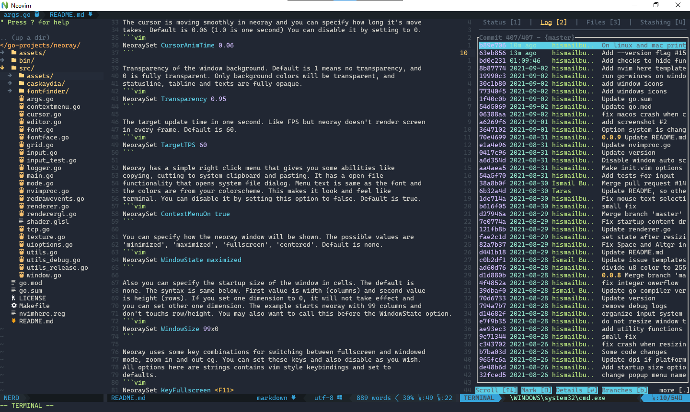

# neoray

neoray is a simple and lightweight gui client for neovim. It's written in
golang using glfw and opengl bindings. Neoray is easy to use and binary size
is small. Supports most of the neovim features. Uses small amount of ram and
leaves no footprints on your computer.



## Installation

You can install neoray with `go install` command:
```
go install github.com/hismailbulut/neoray/src@latest
```

NOTE: To successfully build it on Linux with go you will need to have some
dependencies. On Ubuntu, install following packages:
```
sudo apt install libx11-dev libxcursor-dev libxrandr-dev libxinerama-dev libxi-dev libgl1-mesa-dev build-essential libgtk-3-dev xorg-dev
```
For other distros you need to install corresponding libraries.

Also you can download prebuild binaries from releases page. If you are using
linux you need x11 and gtk3 runtime libraries for run the neoray. Windows and
Macos binaries doesn't have any dependencies except neovim.

## Configuration

Neoray doesn't need any additional configuration, but you can customize it in
your `init.vim`. All options can be set via NeoraySet command. Takes at least
two arguments, first one is the name of the option and others are arguments.
Neoray needs at least 0.4.4 version of neovim installed on your path, however
if you want to use this NeoraySet commands and customize it then you need neovim
version 0.5.0

The cursor is moving smoothly in neoray and you can specify how long it's move
takes. Default is 0.06 (1.0 is one second) You can disable it by setting to 0.
```vim
NeoraySet CursorAnimTime 0.06
```

Transparency of the window background. Default is 1 means no transparency, and
0 is fully transparent. Only background colors will be transparent, and
statusline, tabline and texts are fully opaque.
```vim
NeoraySet Transparency 0.95
```

The target update time in one second. Like FPS but neoray doesn't render screen
in every frame. Default is 60.
```vim
NeoraySet TargetTPS 60
```

Neoray has a simple right click menu that gives you some abilities like
copying, cutting to system clipboard and pasting. It has a open file
functionality that opens system file dialog. Menu text is same as the font and
the colors are from your colorscheme. This makes it look and feel like
terminal. You can disable it by setting this option to false. Default is true.
```vim
NeoraySet ContextMenuOn true
```

You can add custom buttons to context menu. First give a name to your button
and write your command. You must escape spaces in the name and command. Every
command adds a new button. My advice to you is don't write entire command here,
write a function that does your job and call the function here. Do not escape
space between name and command.
```vim
NeoraySet ContextMenuItem Say\ Hello :echo\ "Hello\ World!"
```

Neoray can handle some of the unicode box drawing characters itself, draws them
pixel aligned which makes no gap between glyphs and makes them visually
compatible with each other. This is enabled by default but you can disable it
and use the font's glyphs.
```vim
NeoraySet BoxDrawingOn true
```

You can specify how the neoray window will be shown. The possible values are
'minimized', 'maximized', 'fullscreen', 'centered'. Default is none.
```vim
NeoraySet WindowState maximized
```

Also you can specify the startup size of the window in cells. The default is
none. The syntax is same below. First value is width (columns) and second value
is height (rows). If you set one dimension to 0, it will not take effect and
you can set other one dimension. The example starts neoray with 99 columns and
don't touchs row/height. You may also want to call this before the WindowState option.
```vim
NeoraySet WindowSize 99x0
```

Neoray uses some key combinations for switching between fullscreen and windowed
mode, zoom in and out eg. You can set these keys and also disable as you wish.
All options here are strings contains vim style keybindings and set to
defaults.
```vim
NeoraySet KeyFullscreen <F11>
NeoraySet KeyZoomIn     <C-kPlus>
NeoraySet KeyZoomOut    <C-kMinus>
```

NOTE: The old neoray_* options are deprecated and will be removed soon.
___
### font
Neoray respects your guifont option, finds the font and loads it. If it can't
find your font, try with different names and also with file name. Giving full
shared name except the style and weight names will give best result. You can
change the font without needing restart neoray. Underscores are treated as
spaces. If you think you tried every possibilities but neoray still can't find
the font, please report to me.
```vim
set guifont=Consolas:h11
set guifont=Ubuntu\ Mono:h12
set guifont=:h13 " Use default font with 13 pt size
```
NOTE: For now neoray doesn't support ttc fonts.
___
### exaple init.vim with all options
```vim
if exists('g:neoray')
    set guifont=Go_Mono:h11
    NeoraySet CursorAnimTime 0.08
    NeoraySet Transparency   0.95
    NeoraySet TargetTPS      120
    NeoraySet ContextMenuOn  TRUE
    NeoraySet BoxDrawingOn   TRUE
    NeoraySet WindowSize     100x40
    NeoraySet WindowState    centered
    NeoraySet KeyFullscreen  <M-C-CR>
    NeoraySet KeyZoomIn      <C-ScrollWheelUp>
    NeoraySet KeyZoomOut     <C-ScrollWheelDown>
endif
```

You can disable all of these features.
```vim
if exists('g:neoray')
    NeoraySet CursorAnimTime 0
    NeoraySet ContextMenuOn  FALSE
    NeoraySet BoxDrawingOn   FALSE
    NeoraySet KeyFullscreen  <>
    NeoraySet KeyZoomIn      <>
    NeoraySet KeyZoomOut     <>
endif
```
___
### flags
Neoray accepts some flags for startup options and more. Other flags are used
for creating neovim. You can look all of them starting neoray with -h option.

Some of them are very important (at least for me)

#### --single-instance, -si
When this option has given, neoray opens only one instance. Others will send
all flags to already open instance and immediately quits. This is usefull for
game engine like programs that you can use neovim as an external editor. For
examle if you are using godot engine you can set external editor exec path to
neoray executable and exec flags to this:
```
-si --file {file} --line {line} --column {col}
```
Now, everytime you open a script in godot, this will open in the same neoray,
and cursor goes to {line} and {col}
___
### contributing
All types of contributing are apreciated. If you want to be a part of this
project you can open issue when you find something not working, or help
development by solving issues and implementing some features what you want.
___
### development
The source code is well documented enough. I try to make everything
understandable. Neoray has no external dependencies (except linux). You need to
clone this repository and perform a go get command. Everything will be
installed and you will ready to fly.
___
### copyright
Neoray is licensed under MIT license. You can use, change, distribute it
however you want.
